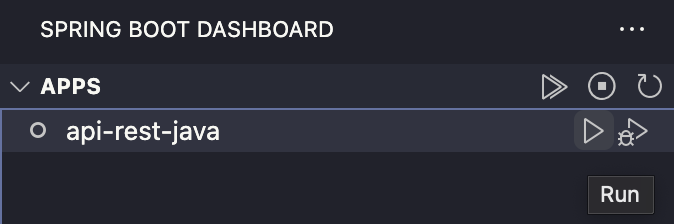

# Seja Bem-Vindo a LEARNING API!

<br />
<p align="center">
    

  <h3 align="center"></h3>
 <br />
  <p align="center">
     Sumário
      <p align="center">
  <a href="#sobre"> Sobre </a> |
  <a href="#conhecimentos-praticados"> Conhecimentos Praticados </a> |
  <a href="#rodando-o-projeto"> Rodando o Projeto </a> |
  <a href="#desenvolvido-por"> Desenvolvido por </a> |
  <a href="#observações"> Observações </a>       
       <br />
    <br />
    <h1 align="center">
 </h1>
  </p>
</p>

Este projeto foi iniciado com [Spring Boot](https://start.spring.io/).

## Sobre

Este projeto foi desenvolvido durante o meu estágio de programação com o objetivo de praticar e fixar o aprendizado aplicado neste repositório: [Java Rest Api](https://github.com/CibeleMartins/javaApiRest) bem como construir uma API a qual fosse possível fazer a integração com esta aplicação frontend em Angular [Check Learning](https://github.com/CibeleMartins/learningApi). Esta API utilizou das mesmas tecnologias da Java Rest Api, no entanto, o modelo DTO foi aplicado somente na entidade de usuário, pois somente esta entidade deveria ter alguns dados omitidos no momento da resposta das requisições.

## Conhecimentos Praticados

✔ Java <br>
✔ Spring Boot <br>
✔ MVC <br>
✔ DTO <br>

## Rodando o Projeto
- Utilize o Git Clone no repositório.
- Abra o projeto no Vs Code
- Certifique-se de instalar todas as dependências no arquivo pom.xml
- E de ter instalado essas extensões: Java Extension Pack e Spring Boot Extension Pack.
- Crie uma pasta .vscode fora da pasta raiz do projeto
- Crie um arquivo chamado launch.json
- Dentro deste arquivo insira este trecho de código:
```javascript
{
  "configurations": [
    {
      "type": "java",
      "name": "Spring Boot-ApiRestJavaApplication<api-rest-java>",
      "request": "launch",
      "cwd": "${workspaceFolder}",
      "mainClass": "br.com.teste.apirestjava.ApiRestJavaApplication",
      "projectName": "api-rest-java",
      "args": "",
      "envFile": "${workspaceFolder}/.env",
      "env": {
        "DB_URL": "URL DO BANCO DE DADOS",
        "DB_USERNAME": "NOME DE LOGIN NO SEU BANCO DE DADOS",
        "DB_PASSWORD": "SENHA DO SEU BANCO DE DADOS"
      }
    }
  ]
}
```
- Isso vai garantir que a API funcione com as variáveis de ambiente definidas no application.properties

- Agora é só rodar a aplicação no dashboard do Spring Boot 



## Desenvolvido por

- [Cibele Martins](https://github.com/CibeleMartins)